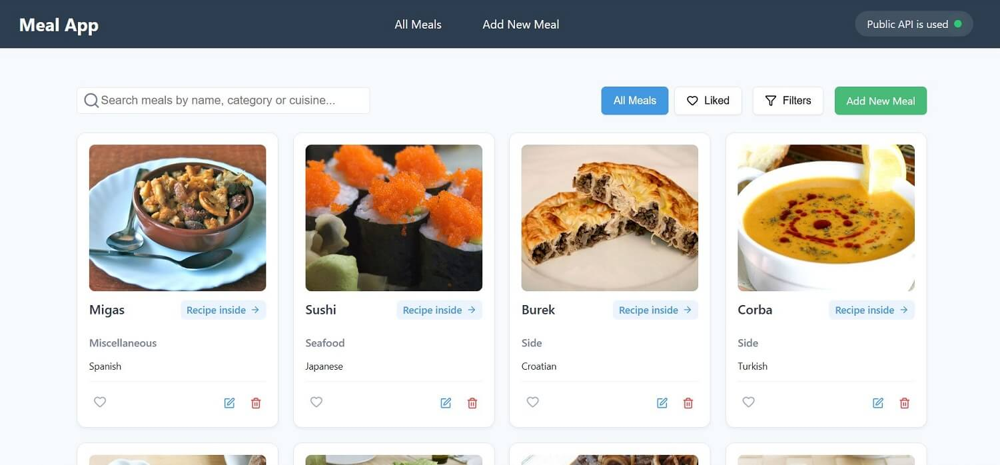
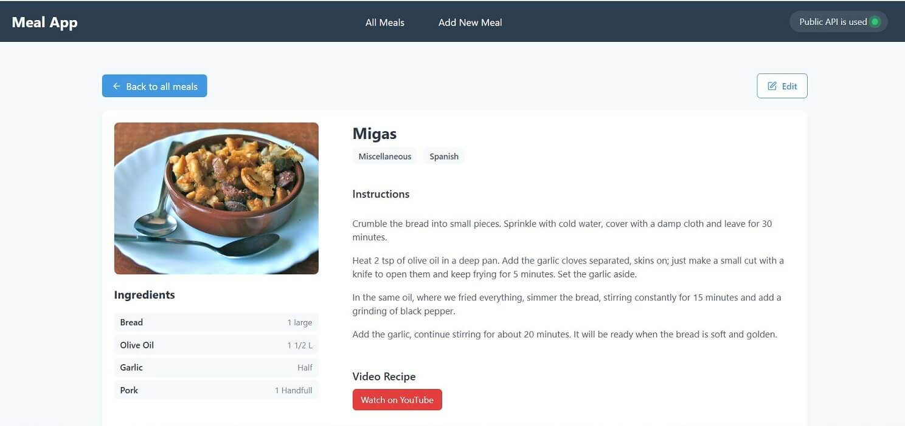
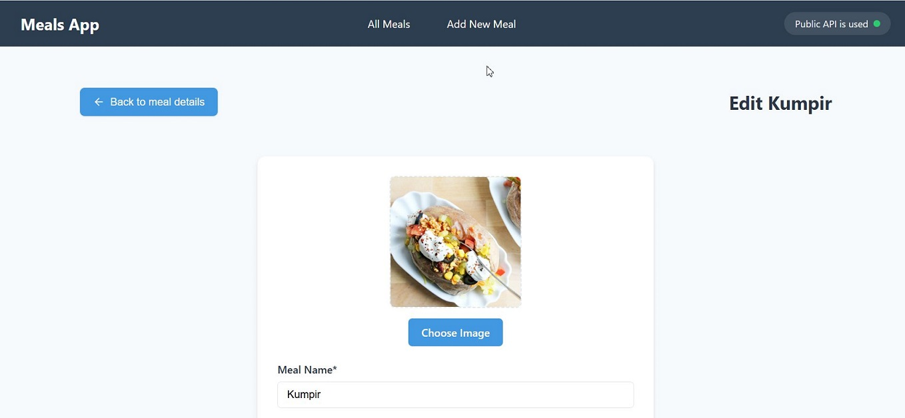
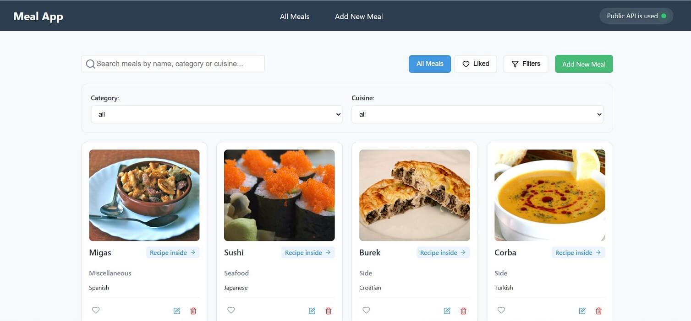
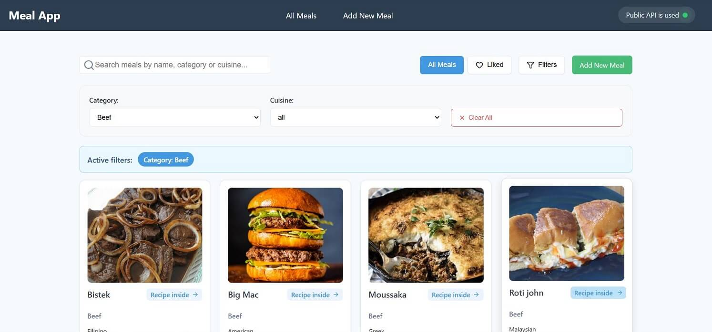

# 🍽️ Meals App

React-приложение для просмотра, поиска и фильтрации блюд с возможностью добавления в избранное. Управление и создание рецептов блюд с использованием TheMealDB API. Позволяет просматривать популярные блюда, создавать собственные рецепты, редактировать и управлять избранным.

## 🌟 Особенности

- Просмотр популярных блюд из API TheMealDB в виде карточек
- Поиск и фильтрация блюд (по названию, категории или кухне)
- Добавление/редактирование пользовательских блюд
- Система лайков и избранного
- Детальная страница с полной информацией о каждом блюде
- Удаление блюд с подтверждением
- Пагинация для удобной навигации
- Адаптивный дизайн
- Локальное хранение пользовательских данных (лайки, пользовательские блюда, удаленные блюда)
- Валидация форм с React Hook Form и Zod

## 🛠 Технологии

- **Frontend**:
  - React 18
  - TypeScript 5.0
  - Redux Toolkit + RTK Query
  - React Router DOM
- **Валидация форм**:
  - React Hook Form
  - Zod (схемы валидации)
- **Стили**:
  - CSS Modules
  - Lucide React (иконки)
- **API**: [TheMealDB API](https://www.themealdb.com/)
- **Сборка**: Vite 5.0

## 🚀 Установка и запуск

1. Клонируйте репозиторий:

git clone <repository-url>
cd meals-app-test

2. Установите зависимости:

npm install

3. Запустите приложение:

npm run dev

4. Откройте в браузере:

http://localhost:5173

## 📂 Структура проекта

src/

├── api/ # API слои и типы

├── assets/ # Изображения и статические файлы

├── components/ # UI компоненты

├── pages/ # Страницы приложения

├── store/ # Redux store

├── App.tsx # Главный компонент

└── main.tsx # Точка входа

## 🎨 Компоненты

- MealCard - Карточка блюда с действиями (лайк, редактирование, удаление)

- MealForm - Форма для создания и редактирования блюд с валидацией

- Pagination - Навигация по страницам

- ConfirmationModal - Модальное окно подтверждения действий

- InputField/TextAreaField - Переиспользуемые поля формы

- ImageUpload - Загрузка и предпросмотр изображений

- IngredientForm - Динамическая форма ингредиентов

## 📱 Страницы

- Products - Главная страница со списком всех блюд, поиском и фильтрацией

- ProductDetail - Детальная информация о блюде с ингредиентами и инструкциями

- CreateProduct - Создание нового пользовательского блюда

- EditProduct - Редактирование существующего блюда

## 🌐 API Endpoints

- GET /search.php?s={name} - Поиск блюд по названию

- GET /lookup.php?i={id} - Получение блюда по ID

- GET /filter.php?c={category} - Фильтрация по категории

- GET /categories.php - Список категорий

- GET /random.php - Случайное блюдо

## 💾 Локальное хранилище

Приложение сохраняет в localStorage:

- Пользовательские блюда (userMeals)

- Лайки (likedMeals)

- Удаленные блюда (removedMeals)

- Отредактированные API блюда (editedMeals)

## 🔧 Особенности реализации

- Редактирование API блюд: Возможность редактировать блюда из API с сохранением изменений

- Умный поиск: Поиск активируется только при вводе 3+ символов

- Валидация форм: Полная валидация с кастомными сообщениями об ошибках

- Оптимизация: React.memo для предотвращения лишних ререндеров

- Обработка ошибок: Грациозная обработка ошибок API и изображений

- Адаптивность: Полная поддержка мобильных устройств

## 📝 Скрипты

- npm run dev - Запуск development сервера

- npm run build - Сборка production версии

- npm run preview - Просмотр собранной версии

- npm run lint - Запуск ESLint

## 🎯 Планы развития

- Реализовать meal planning

- Добавить shopping list functionality

- Интеграция с дополнительными food API

- PWA поддержка

- Оффлайн режим

- Система рейтингов и отзывов
