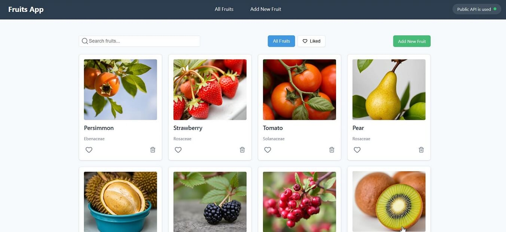

# 🍏 FruitVice App

[](https://reactjs.org/)
[](https://www.typescriptlang.org/)
[](https://vitejs.dev/)

React-приложение для просмотра информации о фруктах с использованием API FruityVice. Позволяет просматривать, добавлять и удалять фрукты, а также добавлять их в избранное.



## 🌟 Особенности

- Просмотр списка фруктов с пагинацией
- Поиск и фильтрация фруктов
- Добавление/редактирование пользовательских фруктов
- Детальная страница с информацией о каждом фрукте
- Удаление фруктов
- Добавление в избранное
- Адаптивный дизайн
- Локальное хранение пользовательских фруктов

## 🛠 Технологии

- **Frontend**: 
  - React 18
  - TypeScript
  - Redux Toolkit + RTK Query
  - React Hook Form + Zod для валидации
  - Vite
- **Стили**: 
  - CSS Modules
  - Lucide React (иконки)
- **API**: [FruityVice API](https://www.fruityvice.com/)

## 🚀 Установка и запуск

1. Клонируйте репозиторий:

   git clone https://github.com/ваш-username/fruitvice-app.git
   cd fruitvice-app
   
2. Установите зависимости:

npm install   

3. Запустите приложение:

bash
npm run dev

4. Откройте в браузере:

text
http://localhost:5173

## 📂 Структура проекта

src/

├── api/              # API слои и типы

├── assets/           # Изображения и статические файлы

├── components/       # UI компоненты

├── pages/            # Страницы приложения

├── store/            # Redux store

├── App.tsx           # Главный компонент

└── main.tsx          # Точка входа

## 🎨 Компоненты

- FruitCard - Карточка фрукта

- FruitForm - Форма добавления/редактирования

- Products - Страница списка фруктов

- ProductDetail - Детальная страница фрукта

- Pagination - Компонент пагинации

- Navbar - Навигационная панель

## 🌐 API Endpoints

- GET /fruit/all - Получить все фрукты

- GET /fruit/{id} - Получить фрукт по ID


# React + TypeScript + Vite

This template provides a minimal setup to get React working in Vite with HMR and some ESLint rules.

Currently, two official plugins are available:

- [@vitejs/plugin-react](https://github.com/vitejs/vite-plugin-react/blob/main/packages/plugin-react) uses [Babel](https://babeljs.io/) for Fast Refresh
- [@vitejs/plugin-react-swc](https://github.com/vitejs/vite-plugin-react/blob/main/packages/plugin-react-swc) uses [SWC](https://swc.rs/) for Fast Refresh

## Expanding the ESLint configuration

If you are developing a production application, we recommend updating the configuration to enable type-aware lint rules:

```js
export default tseslint.config([
  globalIgnores(['dist']),
  {
    files: ['**/*.{ts,tsx}'],
    extends: [
      // Other configs...

      // Remove tseslint.configs.recommended and replace with this
      ...tseslint.configs.recommendedTypeChecked,
      // Alternatively, use this for stricter rules
      ...tseslint.configs.strictTypeChecked,
      // Optionally, add this for stylistic rules
      ...tseslint.configs.stylisticTypeChecked,

      // Other configs...
    ],
    languageOptions: {
      parserOptions: {
        project: ['./tsconfig.node.json', './tsconfig.app.json'],
        tsconfigRootDir: import.meta.dirname,
      },
      // other options...
    },
  },
])
```

You can also install [eslint-plugin-react-x](https://github.com/Rel1cx/eslint-react/tree/main/packages/plugins/eslint-plugin-react-x) and [eslint-plugin-react-dom](https://github.com/Rel1cx/eslint-react/tree/main/packages/plugins/eslint-plugin-react-dom) for React-specific lint rules:

```js
// eslint.config.js
import reactX from 'eslint-plugin-react-x'
import reactDom from 'eslint-plugin-react-dom'

export default tseslint.config([
  globalIgnores(['dist']),
  {
    files: ['**/*.{ts,tsx}'],
    extends: [
      // Other configs...
      // Enable lint rules for React
      reactX.configs['recommended-typescript'],
      // Enable lint rules for React DOM
      reactDom.configs.recommended,
    ],
    languageOptions: {
      parserOptions: {
        project: ['./tsconfig.node.json', './tsconfig.app.json'],
        tsconfigRootDir: import.meta.dirname,
      },
      // other options...
    },
  },
])
```
